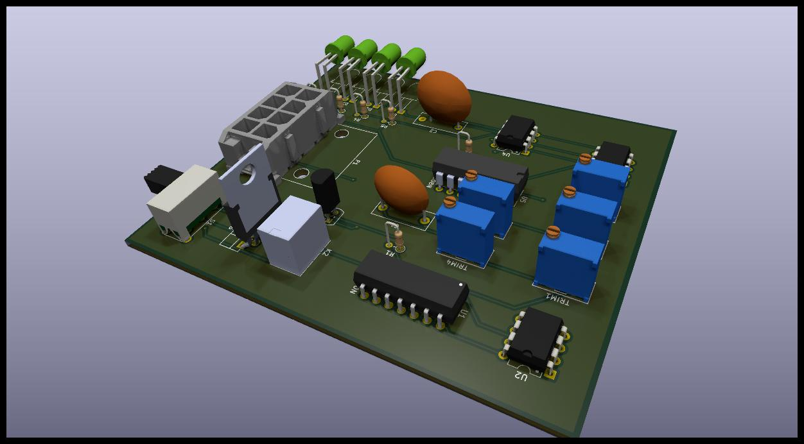

# Team Petronarc GECT
# bspd_v1
# BSPD_V1 — Brake System Plausibility Device (Formula Imperial CV)

This repository contains the circuit design, schematics, and documentation for **BSPD_V1**, a low-cost and rule-compliant Brake System Plausibility Device (BSPD) designed for **Formula Imperial Combustion (CV)** vehicles using **mechanical throttle**.

---
|  | 3D view of the BSPD PCB assembly (component placement & enclosure layout) |

##  Overview

The **Brake System Plausibility Device (BSPD)** monitors the **Throttle Position Sensor (TPS)** and **Brake Pressure Sensor (BPS)** to detect unsafe driving conditions — specifically, **when the throttle is open beyond a limit while the brake is applied**.

If such a condition persists for more than a preset time (≈500 ms), the BSPD **opens the shutdown circuit**, cutting engine power (via the fuel pump or ECU relay).

This design follows the **Formula Imperial 2025 Rulebook (E.2.9)** guidelines for CV vehicles.

|  | Electrical schematic showing comparators, thresholds, latch, and relay driver stages |
---

##  Key Features

- ✅ **2 Analog Inputs** — Throttle (0–5 V) and Brake (0–5 V or 0–10 V)
- ✅ **Adjustable Thresholds** for both BPS and TPS (via onboard potentiometers)
- ✅ **Plausibility Delay:** ~0.5 s (adjustable via RC network)
- ✅ **Latch on Fault:** Once tripped, BSPD remains in fault state until the **Primary Master Switch (PMS)** is cycled
- ✅ **Onboard Indicators:** LEDs for Brake threshold, Throttle threshold, and Fault
- ✅ **12 V operation (8–24 V range)** with onboard 5 V regulation
- ✅ **Fail-Safe Relay Output:** Normally Closed (NC) relay for shutdown loop


---

## 🧩 How It Works

1. **TPS Comparator** checks if throttle > 10% (or > set threshold).
2. **BPS Comparator** checks if brake > set pressure (typically ≥ 30 bar).
3. Both outputs go into a **NOR gate** — if both are HIGH (throttle + brake), output triggers fault.
4. A **delay comparator (≈500 ms)** ensures it’s not a false transient.
5. **Relay driver** drops the shutdown loop (fuel pump / ECU power).
6. BSPD stays tripped until **PMS is turned OFF → ON**.

---

## 🪛 Modifications (for FI 2025 Compliance)

| Issue | Action Taken | Rule Reference |
|-------|---------------|----------------|
| Auto reset after 10 s (non-compliant) | Disabled RC network (R12–C7) | FI E.2.9.5 |
| Cockpit reset not allowed | Only resets via PMS cycle | FI E.2.9.6 |
| Power always ON | BSPD powered only from PMS-switched 12 V line | FI E.2.9 |
| Plausibility logic | Verified 0.45 V – 5 V window check and 500 ms delay | FI E.2.9 |

---

## 🧰 Components

| Component | Value | Description |
|------------|--------|-------------|
| LM393 | Dual comparator | Plausibility & fault logic |
| LM7805 / LM2596 | Regulator | 12 V → 5 V logic supply |
| R12 | 100 kΩ | *Removed* to disable auto-reset |
| C7 | 100 µF | *Removed* or open-circuited |
| Relay | 12 V, SPDT, NC used for shutdown loop | Fuel/ECU cutoff |
| LEDs | — | Fault, TPS threshold, BPS threshold indicators |

---

## ⚡ Power & Wiring

```text
Battery +  → Primary Master Switch (PMS)  → Fuse  → BSPD +12 V  → Fuel Pump Relay Coil → ECU

BSPD Signal Output  →  Controls Shutdown Relay  → In series with Fuel Pump or ECU power
